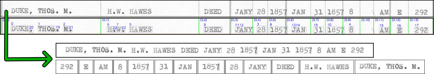
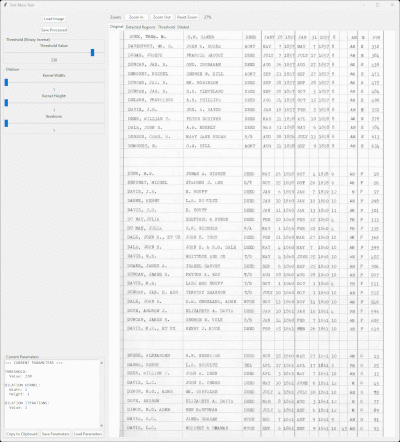
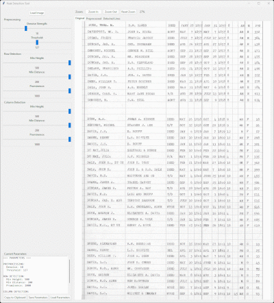

<div align="center">
    
    <h3>DataPrep-TrOCR</h3>
    <p>
        A computer-vision pipeline for converting historical table-based documents<br />
        into high-quality, single-line OCR training data for TrOCR fine-tuning.
    </p>
</div>
<details>
    <summary>Table of Contents</summary>
    <ol>
        <li><a href="#about-the-project">About The Project</a></li>
        <li>
            <a href="#getting-started">Getting Started</a>
            <ul>
                <li><a href="#prerequisites">Prerequisites</a></li>
                <li><a href="#installation">Installation</a></li>
            </ul>
        </li>
        <li><a href="#dataset-generation-pipeline">Dataset Generation Pipeline</a></li>
        <li><a href="#model-fine-tuning">Model Fine-Tuning</a></li>
        <li><a href="#results">Results</a></li>
        <li><a href="#interactive-tool-demos">Interactive Tool Demos</a></li>
        <li><a href="#license">License</a></li>
        <li><a href="#contact">Contact</a></li>
    </ol>
</details>

## About the Project

Historical U.S. County deed index books present a difficult OCR problem:
dense tabular layouts, heavy ruling lines, degraded scans, and inconsistent
typewriter fonts. Off-the-shelf OCR systems struggle due to over-segmentation,
line noise, and spatial ambiguity.

This project implements a two-stage solution:

1. **Dataset Construction Pipeline**
   A computer-vision workflow that converts full-page, grid-based documents into
   normalized, single-line text images suitable for OCR model training.

2. **Model Fine-Tuning**
   A reproducible training pipeline for fine-tuning [`microsoft/trocr-base-printed`](https://huggingface.co/microsoft/trocr-base-printed) on typewritten deed record indices, achieving high exact-match accuracy.

## Getting Started

To get a local copy up and running, follow these steps.

### Prerequisites

-   **Python 3.10** or **3.11** (Recommended).
    -   _Note: Python 3.12+ may encounter issues with current Torch/CUDA dependencies._
-   **GPU:** NVIDIA GPU with CUDA support is highly recommended for training.

### Installation

1.  Clone the repository

    ```bash
    git clone https://github.com/username/dataprep-trocr.git
    cd dataprep-trocr
    ```

2.  Create and activate a virtual environment

    ```bash
    # Linux
    python -m venv venv
    source venv/bin/activate

    # Windows (PowerShell)
    python -m venv venv
    venv\Scripts\Activate.ps1
    ```

3.  **Install System Dependencies (Critical):**
    Install the System-specific versions of PyTorch and PaddlePaddle **before** installing requirements.
    -   **PyTorch:** [Generate Install Command](https://pytorch.org/get-started/locally/)
    -   **PaddlePaddle:** [Generate Install Command](https://www.paddlepaddle.org.cn/en/install/quick)
4.  Install remaining packages
    ```sh
    pip install -r requirements.txt
    ```

<p align="right">(<a href="#readme-top">back to top</a>)</p>

## Dataset Generation Pipeline

The primary contribution of this project is a configurable pipeline that
transforms scanned table documents into uniform, single-line OCR samples.



### Pipeline Overview

**1. Table Region Isolation**
Layout analysis and line detection are used to remove headers, margins, and non-text artifacts. Parameters are tuned interactively using [`line_detection.py`](#line-detection-tool).

**2. Precise Text Bounding Boxes**
OpenCV-based detection generates precise text bounding boxes using [`find_text_bbox.py`](#text-bounding-box-tool), with coordinates stored as JSON for reproducibility.

**3. Row / Column Structure Detection**
Horizontal and vertical separators are detected via peak-intensity analysis to recover the logical table grid. Projection parameters are tuned using [`find_peak_intensity.py`](#peak-intensity-tool).

**4. Row-Wise Text Segmentation**
Text is grouped by row and assembled into fixed-height, single-line images.
Column groups can be reordered to reduce positional overfitting.

### Preventing Overfitting via Column Reordering

During training, models quickly overfit to absolute column position in
structured documents. This pipeline allows arbitrary reordering of column
groups within a row, breaking fixed spatial correlations while preserving
semantic content.

In practice, this proved to be one of the two most effective techniques for
improving generalization.

<p align="right">(<a href="#readme-top">back to top</a>)</p>

## Model Fine-Tuning

This project includes a reference training pipeline demonstrating how the
generated dataset can be used to fine-tune `microsoft/trocr-base-printed`
on historical typewritten text.

### Key Training Decisions

-   **Transformers Version Pinning**
    Fine-tuning was unreliable with Transformers ≥ 4.5 due to TrOCR-related
    breaking changes. Version `4.44.2` is pinned intentionally.

-   **Augmentation Matching Pretraining**
    Training uses the same noise model employed during original TrOCR
    pretraining, adapted from the official Microsoft implementation.

-   **Exact-Match Evaluation**
    Although CER/WER were low, visual inspection revealed unacceptable errors.
    Exact match was therefore used as a validation metric during training,
    producing models with substantially better real-world accuracy.

<p align="right">(<a href="#readme-top">back to top</a>)</p>

## Results

The fine-tuned model achieves strong exact-match accuracy on dense,
typewritten deed records and generalizes well across pages with
varying layout and degradation.

[](https://huggingface.co/YOUR_USERNAME/YOUR_MODEL)

### Built With

-   Python 3.10 / 3.11
-   PyTorch
-   OpenCV
-   Hugging Face Transformers **(4.44.2 pinned)**
-   PaddleOCR (layout detection)
-   SciPy (signal processing)

<p align="right">(<a href="#readme-top">back to top</a>)</p>

## Interactive Tool Demos

These tools were used to visually tune parameters that are later reused
verbatim in the dataset construction notebook.

### Line Detection Tool

`line_detection.py`


### Text Bounding Box Tool

`find_text_bbox.py`



### Peak Intensity Tool

`find_peak_intensity.py`



<p align="right">(<a href="#readme-top">back to top</a>)</p>

## License

This project is licensed under the [MIT License](LICENSE) - see the [LICENSE](LICENSE) file for details.

<p align="right">(<a href="#readme-top">back to top</a>)</p>

## Contact

My Full Name- [GitHub](https://github.com/username)

Project Link: [https://github.com/username/dataprep-trocr](https://github.com/username/dataprep-trocr)

<p align="right">(<a href="#readme-top">back to top</a>)</p>
